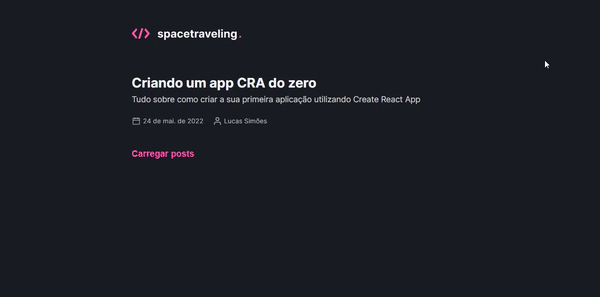
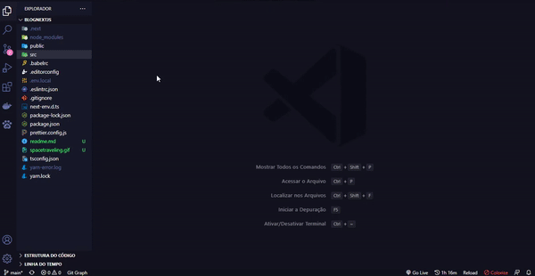

# Learning CMS/NextJs
 Meu aprendizado com NextJs e CMS

 ✓ Working With Javascript!  
 ✓ Working With TypeScript!  
 ✓ Working With React!  
 ✓ Working With React-Icons!  
 ✓ Working With NextJs!  
 ✓ Working With Prismic!  
 ✓ Working With Prismic-dom!  
 ✓ Working With SASS!  

 <h1>✅Project</h1>
 <h3>📚 Funcionamento</h3>

 <h6 align="center">
   
 </h6>
 <h2></h2>

 <h3>📚 Código</h3>
 <h6 align="center">
    
  </h6>

